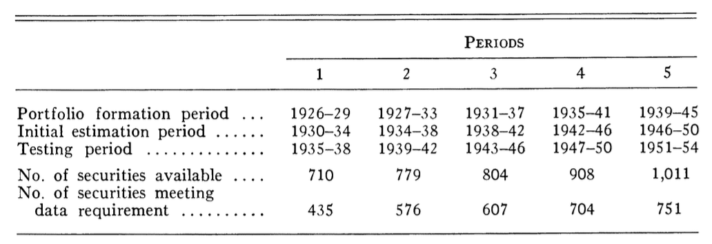

# 金融实证研究论文模型R代码重现
rokia.org  
2016-05-10  

----

这篇文章是给WISERclub同学的一个交流会的内容，主要是介绍如何用Base R实现Fama&MacBeth(1973)这篇论文的模型实现。这次交流来源于一个学生的提问，我发现这个问题比较综合，使用的方法在金融实证文章中也比较有代表，所以总结出来一起分享。

选择这个topic的主要理由如下：

- 论文使用股票交易数据，数据获取容易

- 论文中模型逻辑复杂，回归中自变量的计算过程复杂

- 涉及多张表的数据动态生成与交叉关联应用

- 涉及移动回归，回归中使用的数据时间窗是滚动的

- 涉及分组回归且需提取、计算回归系数及残差的标准差

- 要将n个步骤的回归结果汇总到一个表，且需体现不同的回归id

----

## 问题描述

这篇论文主要要做的事情概括来说是：

- 构造组合收益率并对组合前一期beta值和组合前一期回归残差的标准差进行回归，然后进行t检验。

详细要求参考论文。

## 算法描述

- 第一步：对每个period的 Portfolio formation period(pplist)的所有股票进行回归（RET～EWRTED）（reg.pp），将回归系数从小到大排列，根据回归系数大小，将所有股票等分为20组。

- 第二步：对每个period的在第一步分组的股票进行跟踪。在Testing period(**tplist**)周期中**逐月**对每组股票进行回归分析（AVG_RET_bygroup～BETA+SD_resid）(reg.3)。

- 2.1 计算因变量：提取pplist每组股票的代码清单，然后根据代码清单在**tplist**中提取对应期间(**逐月**)的股票数据。分组计算RET的均值AVG_RET_bygroup。

- 2.2 计算自变量：提取pplist每组股票的代码清单，然后根据代码清单在**iplist**中提取对应期间（**开始5年**）的股票数据。分股票进行回归（RET～EWRTED）(reg.2)，将回归结果的beta以及sd_resi分组计算均值。

- 第三步，将所有period的第一步、第二步的工作中计算的回归结果汇总到一个数据集。
